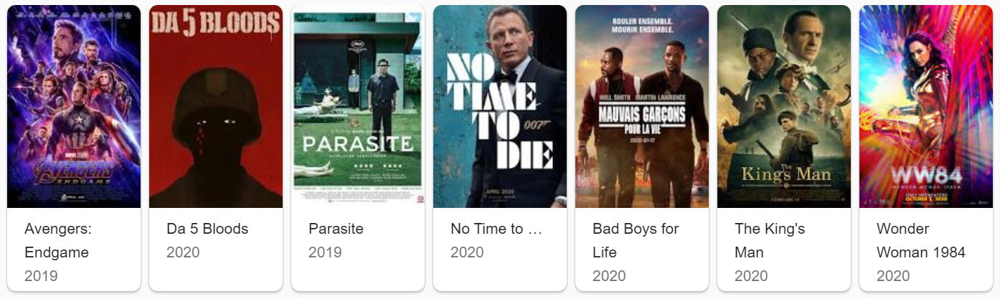
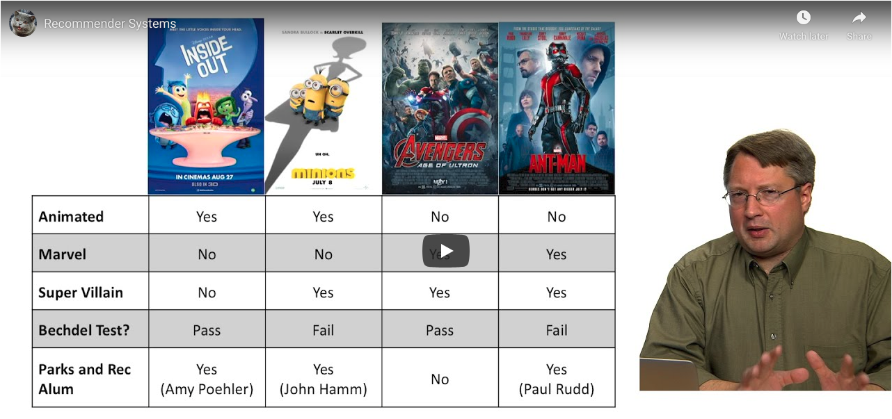

# Streamlit-based Recommender System
#### EXPLORE Data Science Academy Unsupervised Predict

## 1) Overview



This repository forms the basis of *Task 2* for the **Unsupervised Predict** within EDSA's Data Science course. It hosts template code which will enable students to deploy a basic recommender engine based upon the [Streamlit](https://www.streamlit.io/) web application framework.

As part of the predict, students are expected to expand on this base template; improving (and fixing) the given base recommender algorithms, as well as providing greater context to the problem and attempted solutions through additional application pages/functionality.    

#### 1.1) What is a Recommender System?

[](https://youtu.be/Eeg1DEeWUjA)

Recommender systems are the unsung heroes of our modern technological world. Search engines, online shopping, streaming multimedia platforms, news-feeds - all of these services depend on recommendation algorithms in order to provide users the content they want to interact with.

At a fundamental level, these systems operate using similarity, where we try to match people (users) to things (items). Two primary approaches are used in recommender systems are content-based and collaborative-based filtering.  In content-based filtering this similarity is measured between items based on their properties, while collaborative filtering uses similarities amongst users to drive recommendations.

Throughout the course of this Sprint, you'll work on defining this brief explanation further as you come to understand the theoretical and practical aspects of recommendation algorithms.     

#### 1.2) Description of contents

Below is a high-level description of the contents within this repo:

| File Name                             | Description                                                       |
| :---------------------                | :--------------------                                             |
| `edsa_recommender.py`                 | Base Streamlit application definition.                            |
| `recommenders/collaborative_based.py` | Simple implementation of collaborative filtering.                 |
| `recommenders/content_based.py`       | Simple implementation of content-based filtering.                 |
| `resources/data/`                     | Sample movie and rating data used to demonstrate app functioning. |
| `resources/models/`                   | Folder to store model and data binaries if produced.              |
| `utils/`                              | Folder to store additional helper functions for the Streamlit app |

## 2) Usage Instructions

#### 2.1) Improving your recommender system
The primary goal of this task within the Unsupervised Predict is to make students aware of (and ultimately competent in handling) the complexities associated with deploying recommender algorithms in a live environment. These algorithms are resource heavy - requiring high amounts of memory and processing power when associated with larger data sources. As such, you'll need to research and determine the modifications required to deploy this app so that it produces appropriate recommendations with as little latency as possible. This will not be a trivial task, but we know you'll give your best shot :star:!  

In order to make your improvements, we have a few instructions to guide you:
  - **Only modify the sections of the base `edsa_recommender.py` file which have been indicated**. The code which has been designated to be left unaltered is used to provide a standard interface during our automated testing of your app. Changing this code may result in our system assigning you a mark of 0 :(

  - **Do not modify the function name and signature for the `*_model` functions in `collaborative_based.py` and `content_based.py`**. As stated above, these functions are used during automated testing. You are, however, supposed to modify/improve the content of these functions with your algorithms developed within Task 1 of the Unsupervised Predict.

  - **Add additional data where needed**. The data files which we've provided you within this repo template serve only as examples. For correct/improved functioning, you may need to add additional data files from sources such as the Kaggle challenge in Task 1, or the S3 bucket provided to you during this sprint. (**NB:** Github doesn't accept large file uploads during a commit. As such, you may need to keep only local copies of your data files. Have a look at how to exclude files from your git commits using a `.gitignore` file [here](https://docs.github.com/en/github/using-git/ignoring-files))

  - **Focus on both algorithmic approaches**. There will be trade-offs for using either collaborative or content based filtering. Try to discover these by attempting to use both approaches in your app.

  - **Use computing power if necessary**. As mentioned before, the compute resources required for this task are heavy. As such, when the need arises, switch to an AWS instance with greater computing power. (**NB:** We'll require that you restrict this to one large AWS instance (t2.2xlarge/t2.xlarge) per team).


#### 2.2) Creating a copy of this repo

| :zap: WARNING :zap:                                                                                     |
| :--------------------                                                                                   |
| Do **NOT** *clone* this repository. Instead follow the instructions in this section to *fork* the repo. |

As described within the Predict instructions for the Unsupervised Sprint, this code represents a *template* from which to extend your own work. As such, in order to modify the template, you will need to **[fork](https://help.github.com/en/github/getting-started-with-github/fork-a-repo)** this repository. Failing to do this will lead to complications when trying to work on the web application remotely.

To fork the repo, simply ensure that you are logged into your GitHub account, and then click on the 'fork' button at the top of this page.

#### 2.3) Running the recommender system locally

As a first step to becoming familiar with our web app's functioning, we recommend setting up a running instance on your own local machine.

To do this, follow the steps below by running the given commands within a Git bash (Windows), or terminal (Mac/Linux):

 1. Ensure that you have the prerequisite Python libraries installed on your local machine:

 ```bash
 pip install -U streamlit numpy pandas scikit-learn
 conda install -c conda-forge scikit-surprise
 ```

 2. Clone the *forked* repo to your local machine.

 ```bash
 git clone https://github.com/{your-account-name}/unsupervised-predict-streamlit-template.git
 ```  

 3. Navigate to the base of the cloned repo, and start the Streamlit app.

 ```bash
 cd unsupervised-predict-streamlit-template/
 streamlit run edsa_recommender.py
 ```

 If the web server was able to initialise successfully, the following message should be displayed within your bash/terminal session:

```
  You can now view your Streamlit app in your browser.

    Local URL: http://localhost:8501
    Network URL: http://192.168.43.41:8501
```

You should also be automatically directed to the base page of your web app. This should look something like:


Congratulations! You've now officially deployed your web-based recommender engine!

While we leave the modification of your recommender system up to you, the latter process of cloud deployment is outlined within the next section.  

#### 2.4) Running the recommender system on a remote AWS EC2 instance

| :zap: WARNING :zap:                                                                                                                                                                                                          |
| :--------------------                                                                                                                                                                                                        |
| As outlined in the previous section, we recommend deploying this app on a larger AWS instance with sufficient memory (t2.2xlarge/t2.xlarge). Note that a restriction of one large compute instance per team will be applied. |

The following steps will enable you to run your recommender system on a remote EC2 instance, allowing it to the accessed by any device/application which has internet access.

Within these setup steps, we will be using a remote EC2 instance, which we will refer to as the ***Host***, in addition to our local machine, which we will call the ***Client***. We use these designations for convenience, and to align our terminology with that of common web server practices. In cases where commands are provided, use Git bash (Windows) or Terminal (Mac/Linux) to enter these.

1. Ensure that you have access to a running AWS EC2 instance with an assigned public IP address.

**[On the Host]:**

2. Install the prerequisite python libraries:

```bash
pip install -U streamlit numpy pandas scikit-learn
conda install -c conda-forge scikit-surprise
```

3. Clone your copy of the API repo, and navigate to its root directory:

```bash
git clone https://github.com/{your-account-name}/unsupervised-predict-streamlit-template.git
cd unsupervised-predict-streamlit-template/
```

| :information_source: NOTE :information_source:                                                                                                    |
| :--------------------                                                                                                                             |
| In the following steps we make use of the `tmux` command. This programme has many powerful functions, but for our purposes, we use it to gracefully keep our web app running in the background - even when we end our `ssh` session. |

4. Enter into a Tmux window within the current directory. To do this, simply type `tmux`.  

5. Start the Streamlit web app on port `5000` of the host

```bash
streamlit run --server.port 5000 edsa_recommender.py
```

If this command ran successfully, output similar to the following should be observed on the Host:

```
You can now view your Streamlit app in your browser.

  Network URL: http://172.31.47.109:5000
  External URL: http://3.250.50.104:5000

```

Where the specific `Network` and `External` URLs correspond to those assigned to your own EC2 instance. Copy the value of the external URL.  

**[On the Client]:**

6.  Within your favourite web browser (we hope this isn't Internet Explorer 9), navigate to external URL you just copied from the Host. This should correspond to the following form:

    `http://{public-ip-address-of-remote-machine}:5000`   

    Where the above public IP address corresponds to the one given to your AWS EC2 instance.

    If successful, you should see the landing page of your recommender system app (image identical to that for the local setup instructions).

**[On the Host]:**

7. To keep your app running continuously in the background, detach from the Tmux window by pressing `ctrl + b` and then `d`. This should return you to the view of your terminal before you opened the Tmux window.

    To go back to your Tmux window at any time (even if you've left your `ssh` session and then return), simply type `tmux attach-session`.

    To see more functionality of the Tmux command, type `man tmux`.

Having run your web app within Tmux, you should be now free to end your ssh session while your webserver carries on purring along. Well done :zap:!

## 3) FAQ

This section of the repo will be periodically updated to represent common questions which may arise around its use. If you detect any problems/bugs, please [create an issue](https://help.github.com/en/github/managing-your-work-on-github/creating-an-issue) and we will do our best to resolve it as quickly as possible.

We wish you all the best in your learning experience :rocket:


